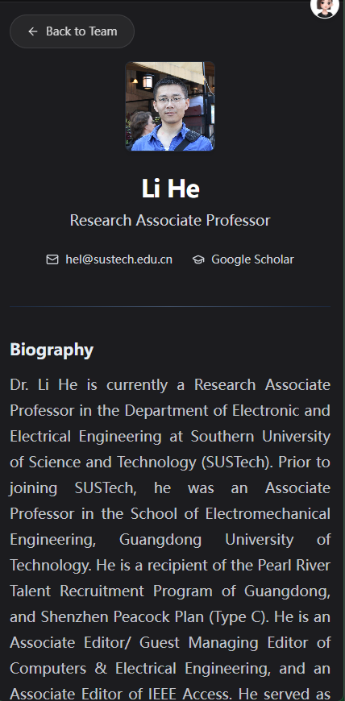

你现在主要是要对 research page 进行一些修改和DEBUG

+ Team 部分 
    + 考虑对不同成员的子页面加上导航，比如localhost:5173/team/123，这样RESEARCH界面的Related Lab Members就可以直接跳转到对应的成员页面
    + 不同成员的子页面在手机端正文内容现在是无边距状态，可以加上恰当合适的边距，现在状况见下图
        
    + 在移动端的时候，顶部轮播图的这个底部的切换按钮很大，很丑，直接删除掉吧

+ Research 界面
    + 实现Related Lab Members部分的跳转
    + 不要对不同部分使用不同颜色，保持一致，比如Keywords这里就不要用颜色标签，跟右边一样就好
    + 正文使用和homepage那里渲染markdown的方法一样去渲染
    + 对左边切换部分做适当的优化，切换部分左边那个竖线我觉得很丑，可以去掉
    + 整体适当美化优化，引入一些现代化的设计元素
+ Home 界面
    + #home > div.absolute.bottom-4.right-4.z-20 > button > div > 
这个首页的下滑按钮可以删掉了，但是保留鼠标下滑就滚动很多的那个的交互