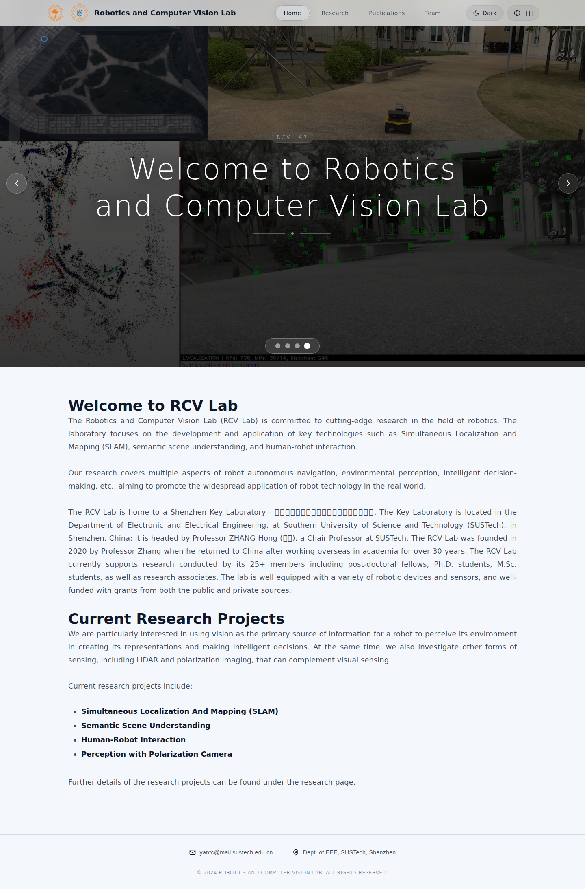
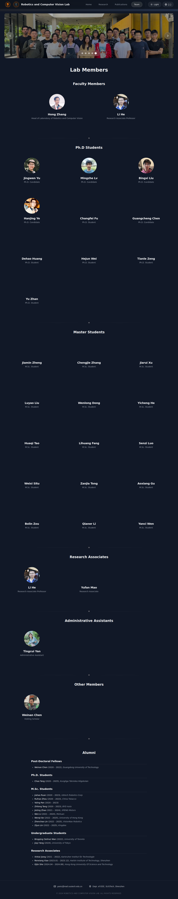
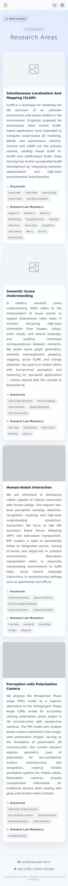
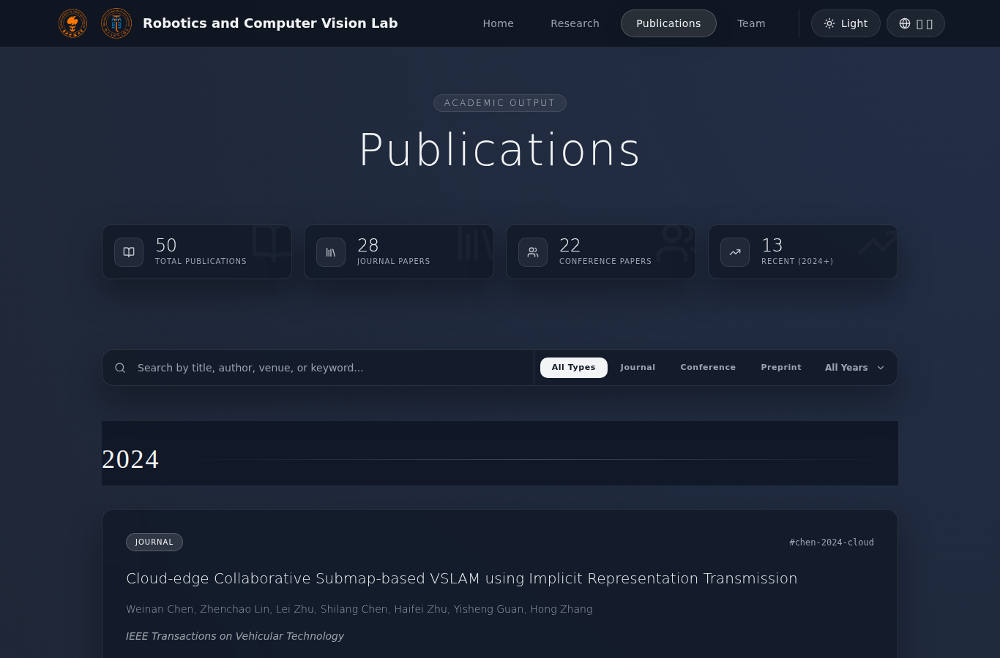

# RCV Website

React + Vite single-page site for the Robotics and Computer Vision Lab.

## Quick start
- Install: `npm install`
- Develop: `npm run dev` (open http://localhost:5173/rcv_website/ because `base` is `/rcv_website/`)
- Build: `npm run build`

## Assets & content
- All static resources live in `public/assets` (media, docs, data). See `ASSETS.md` for how to add new images, markdown, or BibTeX while keeping URLs working after deployment.
- Use the helpers in `src/utils/paths.ts` (`getAssetUrl`, `getContentUrl`) instead of hardcoding `/assets` or `/content` so paths include the `base` prefix in production.
- Home/alumni markdown lives in `public/assets/docs/`; author/profile content lives in `public/content/authors/`.

## Trash (pending deletion)
Legacy update scripts and unused assets were moved to `trash/` so they no longer ship with the site. Delete them after review if you don’t need them.

## Screenshots
- Light – Home hero (desktop)  
  
- Dark – Team page (tablet)  
  
- Light – Research page (mobile)  
  
- Dark – Publications page (desktop)  
  
